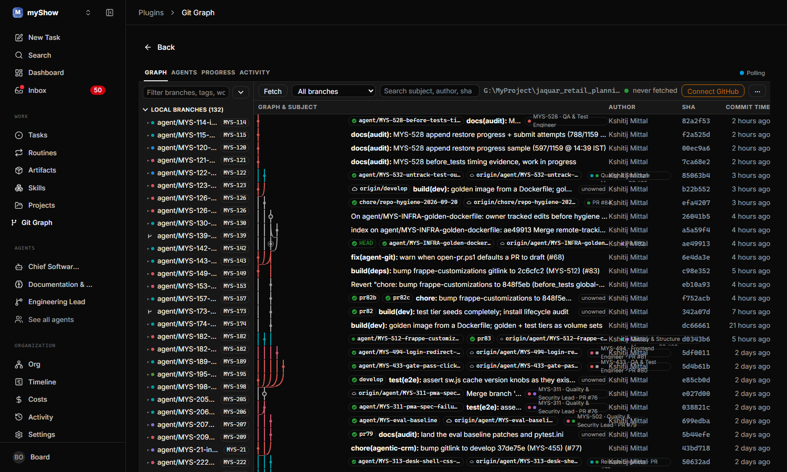

# paperclip-git-graph

A commit graph inside [Paperclip](https://github.com/paperclipai/paperclip). It shows which agent is working on which branch, which issue that branch belongs to, and where its pull request stands.



## What it does

The Graph tab draws the repository history with one lane per branch. Lanes are coloured by the agent that owns the branch, so the same hue follows an agent through the graph, the branch list, and the owner chip on each commit. Branches with no agent stay grey.

Three more tabs read the same data for people who run the company rather than the code:

- Agents: one card per agent with its current branch, last commit, ahead and behind counts against trunk, pull request state, and last run.
- Progress: one row per issue with a four step bar (branch, commits, pull request, merged), sortable by staleness.
- Activity: a timeline of git events (branch created or updated, fetches, run start and finish, pull request opened or merged).

A dashboard widget summarises open pull requests, active agents, and merges this week.

## How ownership is worked out

For each branch the worker merges three signals:

1. The branch name. The default pattern is `agent/{ISSUE-KEY}-slug`; the `issue` capture group maps to a Paperclip issue and its assigned agent.
2. GitHub. A pull request whose head is that branch gives state, author, reviewers, and check status.
3. Run logs. Branch names mentioned in issue comments attribute branches that do not match the pattern.

Every branch records which signals produced its owner, so a mismatch is easy to trace.

## What it uses from Paperclip

The plugin stores nothing of its own outside the host. Commits, refs, pull requests, and events live in the plugin's database namespace. Each branch is an entity, so other plugins and the host can list them. Fetches and merges go to the company activity log. Open pull request and branch counts are written as metrics. One agent tool, `git_graph_branches`, lets agents ask for the branch list instead of running git themselves. The scheduled fetch is a host job, and settings come from the host config form with defaults applied by the worker when nothing has been saved.

Live updates use the host stream bridge when the host provides one. On hosts that do not, the page polls the snapshot metadata every 20 seconds and refreshes when the refs change.

## Install

Requires Node 20 or newer, git on PATH, and Paperclip 2026.831 or newer.

```powershell
scripts/install.ps1
```

```bash
scripts/install.sh
```

The script clones or pulls this repository, installs dependencies, builds, and runs `paperclipai plugin install`. Later updates: `scripts/update.ps1` or `scripts/update.sh`.

Manual install:

```bash
npm install && npm run build && paperclipai plugin install .
```

## Bind a repository

Open Git Graph from the sidebar. The first screen lists the project workspaces Paperclip already knows about, recently used repositories, and a folder browser. Pick one and the graph loads.

From the CLI instead:

```bash
paperclipai plugin local-folder:set paperclip-git-graph repo -C <companyId> --payload-json '{"path":"/abs/path"}'
```

## GitHub access

Public repositories need nothing. For private ones the plugin can reuse a local `gh` login (the default, `githubAuth: auto`) or a token stored as a Paperclip secret. The Connect GitHub button on the page shows which one is active. Tokens are never written to logs or state.

## Settings

| Setting | Default | Meaning |
|---|---|---|
| `theme` | `paperclip` | Visual preset: `paperclip`, `sourcegit`, `gitlens`, or `fork`. Surfaces and text always follow the host theme; presets change density, chip style, and lane colours. |
| `trunk` | `develop` | Branch used for ahead, behind, and merged checks. Falls back to `main`. |
| `githubAuth` | `auto` | `auto`, `secret`, `gh-cli`, or `none`. |
| `githubToken` | none | Secret reference, used when `githubAuth` is `secret` or `auto`. |
| `githubRepo` | from `origin` | `owner/name` override. |
| `fetchIntervalMinutes` | 15 | Background `git fetch` cadence. |
| `commitLimit` | 400 | Commits kept in the cache per company. The page loads 120 at a time as you scroll. |
| `branchPattern` | `^agent/(?<issue>[A-Z]+-\d+)-` | Regex with a named group `issue`. |

## Docs

[Paperclip from the plugin's side](docs/paperclip.md), [SDK reference](docs/sdk-reference.md), [design language](docs/design-language.md).

## Develop

```bash
npm run dev        # esbuild watch; the host reloads dist
npm test
npm run typecheck
```

Layout: `src/worker` (git, cache, ownership, activity, live events), `src/graph` (lane layout), `src/theme` (tokens, presets, agent hues), `src/ui` (page, tabs, welcome screen), `migrations` (plugin database schema).

## Security

The worker runs `git` inside the bound folder and the UI is same origin JavaScript inside Paperclip. Install only from a source you trust.

## License

Apache-2.0. See LICENSE and NOTICE.
