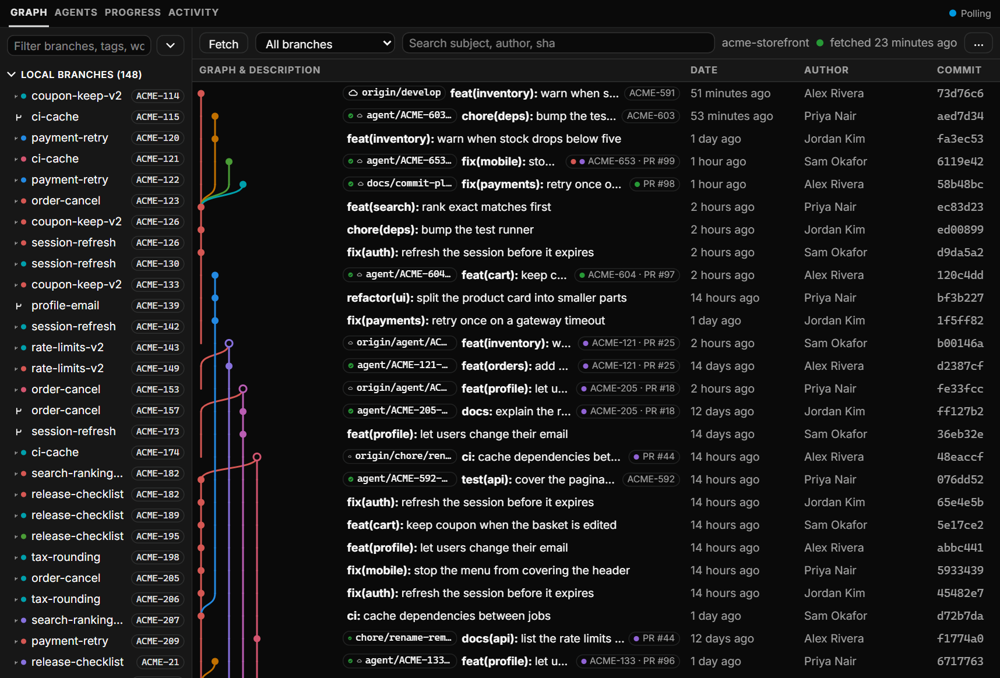
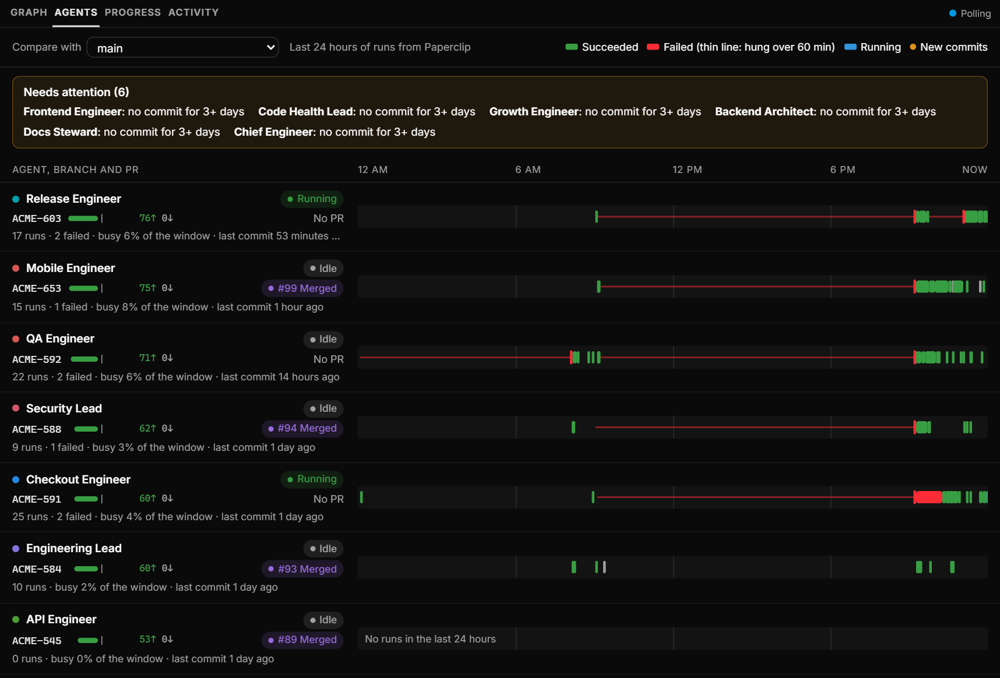
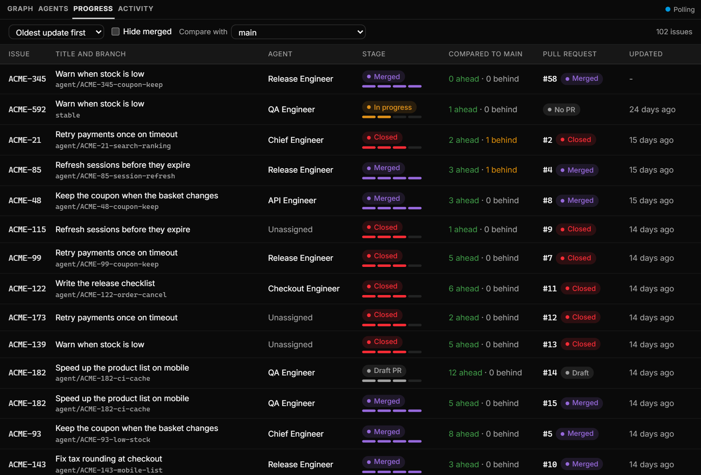
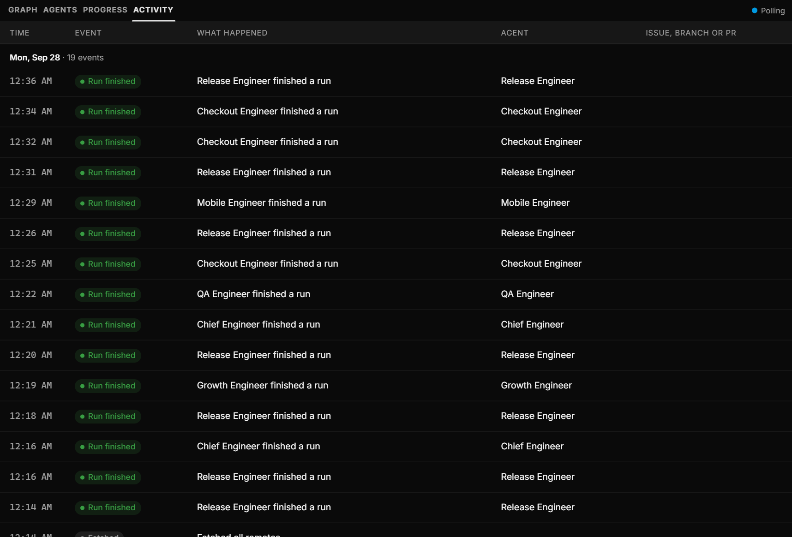
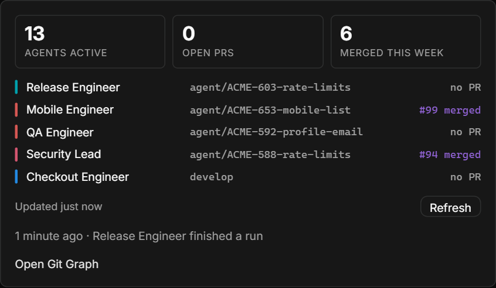

<div align="center">

# Git Graph for Paperclip

**See what your AI agents are doing in git: who is on which branch, which issue it is for, and what is stuck.**

[](https://github.com/Kshitijm7/paperclip-git-graph/actions/workflows/ci.yml)
[](LICENSE)
[](https://github.com/paperclipai/paperclip)
[](tsconfig.json)
[](#install)
[](#contributing)

[Features](#features) · [Install](#install) · [Settings](#settings) · [Contributing](#contributing)

</div>

A plugin for [Paperclip](https://github.com/paperclipai/paperclip). When a company of AI agents works on one repository, it gets hard to tell who is on which branch, which issue that branch is for, and whether anything is stuck. This plugin puts the commit graph, the agents, and their pull requests on one page inside Paperclip, so you can answer those questions without opening a terminal.



> [!NOTE]
> The screenshots use made-up data: an example company called Acme with issue keys like `ACME-123`.

## Features

### Graph

The history of the repository, drawn the way VS Code's Git Graph draws it: one coloured lane per line of work, curved joins at merges, and hollow dots for merge commits. Each row shows the branch label, the commit message, the issue it belongs to and its pull request. Local and remote copies of the same branch share one label. The sidebar lists every branch with its issue key, and you can filter it or pick one branch to narrow the graph.

The page loads 120 commits at a time as you scroll, and the graph column only takes the width that the lanes on screen need.

### Agents

A timeline of every agent's runs over the last 24 hours, one row per agent.



On the left of each row you see the agent's status, its current branch, how far that branch is ahead of and behind the branch you compare against, and its pull request. On the right, green bars are runs that succeeded, red marks are failures, blue is a run still going, and amber dots are new commits. A failed run that hung for over an hour is drawn as a thin line so it doesn't hide the real work.

Above the rows, a Needs attention box lists agents whose last run failed, branches that have fallen far behind, open pull requests with no reviewer, and branches with no commit for a few days. The thresholds are settings. A bar chart at the bottom shows how many runs started each hour across the whole team.

Run data comes from Paperclip's own run history, so the timeline is complete from the moment you install.

### Progress

One row per issue that has a branch.



The stage column says in words where the work is (In progress, In review, Merged, Closed) with a four step bar under it: branch, commits, pull request, merged. You can sort by oldest update or least progress, hide merged work, and choose which branch the ahead and behind counts compare against.

### Activity

A feed of what happened, grouped by day: runs finishing or failing, branches created or moved, pull requests opened, merged or closed, and fetches. Each line is a plain sentence with links to the issue and pull request.



### Dashboard widget

A card for the Paperclip dashboard with agents on a branch, open pull requests, merges this week, and the five most recent agents. It shows the last data it had straight away and refreshes in the background. The Refresh button asks GitHub for new pull request data.



## Where it helps

- You run several agents on one codebase and want to see at a glance who is busy, who is idle and who is stuck.
- You review agent pull requests and want to know which ones are waiting on you and which branches drifted too far from the main line.
- A run failed overnight and you want to find it, and the branch it was working on, in one place.
- You want credit for a commit to stay with the agent that wrote it. The plugin records which agent run moved each branch, so reassigning an issue later doesn't rewrite who did the work.

## How a branch gets its owner

For each branch the plugin combines three signals:

1. The branch name. By default the plugin looks for the company's issue key anywhere in the name, so `feature/ACME-42-login` and `agent/ACME-42-login` both link to ACME-42. You can set your own pattern.
2. GitHub. A pull request whose head is that branch gives its state, author, reviewers and checks.
3. Issue comments. A branch name mentioned in a comment links the branch to that issue.

Each branch keeps a note of which signal produced its owner, so a surprising result is easy to trace.

## Nothing is tied to one project

The plugin works out what it can from your repository and your Paperclip company, and everything else is a setting.

- The branch to compare against is your remote's default branch unless you choose another one, and you can switch it from a dropdown on the Agents and Progress tabs.
- The remote is `origin` if you have one, otherwise the first remote.
- The branch pattern comes from your company's issue prefix.
- The GitHub repository comes from the remote URL.

## Offline and cached

Commits, branches, ownership, pull requests and events are stored in the plugin's own database tables inside Paperclip, so the pages open from the cache even when GitHub or the network is down. GitHub is only called when you press Fetch or Refresh, or when there is no saved copy yet. The page checks for new commits every 20 seconds and redraws only when a branch moved.

## Install

You need Node 20 or newer, git on your PATH, and Paperclip 2026.831 or newer.

```bash
scripts/install.sh
```

On Windows:

```powershell
scripts/install.ps1
```

The script clones or updates this repository, installs dependencies, builds, and runs `paperclipai plugin install`. To update later, run `scripts/update.sh` or `scripts/update.ps1`.

To install by hand:

```bash
npm install && npm run build && paperclipai plugin install .
```

## Bind a repository

Open Git Graph from the Paperclip sidebar. The first screen lists the project workspaces Paperclip already knows, the repositories you used recently, and a folder browser. Pick one and the graph loads.

From the command line:

```bash
paperclipai plugin local-folder:set paperclip-git-graph repo -C <companyId> --payload-json '{"path":"/abs/path"}'
```

## GitHub access

Public repositories need nothing. For private ones the plugin can use your local `gh` login (the default) or a token saved as a Paperclip secret. The Connect GitHub button on the page shows which one is in use. Tokens are never written to logs or plugin state.

## Settings

All settings are in Paperclip's plugin settings form. Empty values are worked out for you.

| Setting | Default | What it does |
|---|---|---|
| `trunk` | empty | Branch to compare against. Empty means the remote's default branch. |
| `remote` | empty | Git remote to use. Empty means `origin`, or the first remote. |
| `branchPattern` | empty | Regex with a named group `issue`. Empty means your company's issue key anywhere in the name. |
| `farBehindCommits` | 20 | Flag a branch this many commits behind. |
| `staleDays` | 3 | Flag a branch with no commit for this many days. |
| `hungRunMinutes` | 60 | Failed runs longer than this are drawn as a thin line. |
| `timelineHours` | 24 | How far back the Agents timeline reaches, up to a week. |
| `githubAuth` | `auto` | `auto`, `secret`, `gh-cli` or `none`. |
| `githubToken` | none | Secret reference for `secret` or `auto`. |
| `githubRepo` | from the remote | `owner/name` override. |
| `fetchIntervalMinutes` | 15 | How often the background `git fetch` runs. |
| `commitLimit` | 400 | Commits kept in the cache. |
| `theme` | `paperclip` | `paperclip`, `sourcegit`, `gitlens` or `fork`. Colours for surfaces and text always follow Paperclip's theme. |

## What it uses from Paperclip

The plugin keeps its data in its own database namespace and reads Paperclip's run history for the timeline. Each branch is also saved as a Paperclip entity, so other plugins can list them. Fetches and merges go to the company activity log, and branch and pull request counts are written as metrics. Agents can call the `git_graph_branches` tool to get the branch list without running git themselves.

## Contributing

Paperclip's plugin ecosystem is young, and this plugin is one small piece of it. If you run agents on Paperclip, your feedback is the most useful thing you can give: what you look for first, what confused you, what you wish the page told you.

Every kind of contribution is welcome, from a typo fix to a new tab:

- Open an [issue](https://github.com/Kshitijm7/paperclip-git-graph/issues/new/choose) for a bug, an idea, or a question. Screenshots help a lot.
- Pick an issue and send a pull request. Small ones are easier to review.
- Try it on your own repository and tell us what broke. Different branch naming schemes and remotes are exactly what we need to test against.
- Build your own Paperclip plugin. The notes in [docs/](docs/) cover the SDK surface this repo uses and may save you some digging.

To work on the code:

```bash
npm install
npm run dev        # rebuilds on save; Paperclip reloads the plugin
npm test
npm run typecheck
```

`npm run typecheck` and `npm test` should both pass before you open a pull request. CI runs both, plus the build, on Linux and Windows with Node 20 and 22 for every pull request. The code layout and the rules we follow are in [CLAUDE.md](CLAUDE.md); the parts that matter most are to use Paperclip's own services before writing anything custom, to take colours from the host theme, and to add no runtime dependencies.

First time contributing to open source? Say so in your pull request and we'll help you through it.

## Docs

- [Paperclip from the plugin's side](docs/paperclip.md)
- [SDK reference](docs/sdk-reference.md)
- [Design language](docs/design-language.md)

## Security

The worker runs `git` inside the folder you bind, and the pages are JavaScript running inside Paperclip. Only install plugins from a source you trust. To report a security problem, open a private advisory on GitHub instead of a public issue.

## License

Apache-2.0. See LICENSE and NOTICE.
